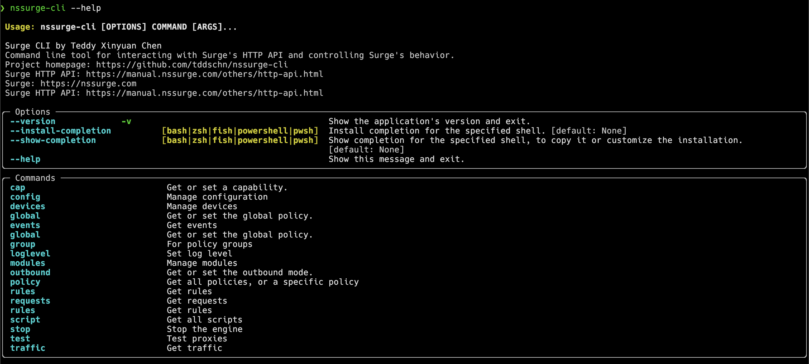
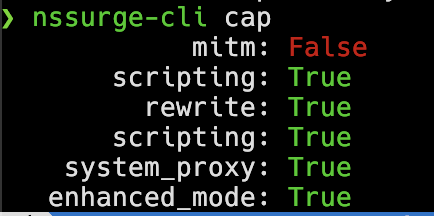

# NSSurge CLI

Command line [Surge HTTP API](https://manual.nssurge.com/others/http-api.html) Client

You can use it to get/set Surge rules / policies / proxy groups, get recent requests / events and much more. 

This projects fully implements the [Surge HTTP API spec](https://manual.nssurge.com/others/http-api.html).

- [NSSurge CLI](#nssurge-cli)
  - [Installation](#installation)
    - [pipx](#pipx)
    - [pip](#pip)
  - [Usage](#usage)
    - [Screenshots](#screenshots)
  - [Develop](#develop)
  - [See also](#see-also)

## Installation

### pipx

This is the recommended installation method.

```
$ pipx install nssurge-cli
```

### [pip](https://pypi.org/project/nssurge-cli/)

```
$ pip install nssurge-cli
```

## Usage

```
nssurge-cli --help
```



### Screenshots

```
nssurge-cli cap
```


## Develop

```
$ git clone https://github.com/tddschn/nssurge-cli.git
$ cd nssurge-cli
$ poetry install
```

## See also

- [nssurge-api](https://github.com/tddschn/nssurge-api): Python implementation of the [Surge HTTP API spec](https://manual.nssurge.com/others/http-api.html) client using `aiohttp`, used by this project
- [Surge HTTP API spec](https://manual.nssurge.com/others/http-api.html)